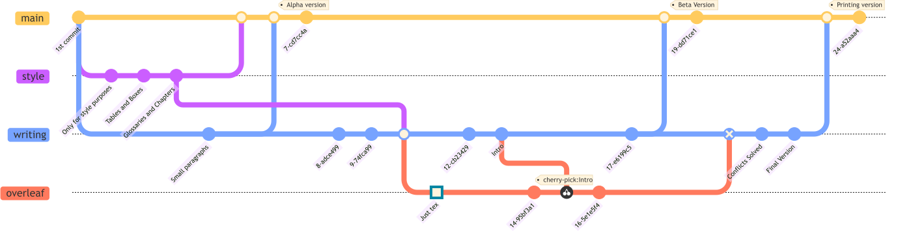

# Thesis Manuscript Repository 📄

This repository contains the source code and assets for my thesis manuscript.
It is written with **LaTeX**, compiled via **LuaLaTeX**, and includes figures
generated using **Python (Matplotlib and Seaborn)**, **GNUPlot** and **Wolfram
Mathematica**. Some diagrams were created with **Mermaid**, **Diagrams**, and
**Graphviz**. Image editing was done in **GIMP** and **Inkscape**, some
animations and pictures were also done with **Blender** (mainly for slides but
not the manuscript.

Happy writting ✨

Contact me if you need help but take into account that this project is not my
priority, since well.. i've already submited my thesis.

---

## Compilation Instructions

1. **Prerequisites** 🏗️
    - A **TeX** distribution supporting **LuaLaTeX** (e.g., TeX Live 2024 or newer).
    - **Make**, if you want to use the provided Makefile.
    - Optional but useful: **Python**, **GNUPlot**, **Graphviz**, **GIMP**, **Inkscape**, **Blender**, etc.

2. **Quick Build** 🚀
    - `make all` — Compiles the full thesis, generate the plots and images.
    - `make style` — Compiles a standalone PDF with example tables, box styles, etc.
    - `make test chapter=<chapter_name>` — Compiles only a specific chapter (e.g., `chapter=methodology`).
    - `make fast` — Compiles quickly without running BibTeX, glossaries (useful for layout previews).

---

## Repository Structure

- `chapters/`
  Individual `.tex` files for each chapter with their own subdivision.
- `figures/` or `img`
  Plots, images, diagrams, and figure source files.
- `preambulo/`
  Custom `.tex` files for preamble [libraries].
- `styles/`
  Custom `.sty` files and font configurations (includes basic Cyrillic support).
- `Makefile`
  Automates compilation workflows.
- `tesis.tex`
  Main entry point for building the thesis PDF.

> ⚠️  **Note on Windows**: This project is tested on GNU/Linux, macOS, and
Overleaf. Windows is untested and probably unsupported.

---

## Git Workflow and PLMlatex (Overleaf) Strategy

While the recommended workflow is through the command line using vim, nano,
emacs (or any text editor you want), Overleaf support is provided but with
limitations. A Git-based branching strategy helps manage this:

- `writing` — Main local branch for manuscript development.
- `overleaf` — Mirror branch for Overleaf use.

### Suggested Process for Overleaf Sync

1. Checkout or create the `overleaf` branch locally.
2. Pull any changes made in Overleaf.
3. (Optional) Delete existing files on Overleaf to reset the working state.
4. Merge from `writing` using:
   ````
   git merge writing --allow-unrelated-histories
   ````

The next diagram has not real git tree of my manuscript but shows the main idea
of how it should flow over the different branches.


> ⚠️  **Note**: The use of git on Overleaf is only for users who pay. The
project is
big so you probably also need compilation time over than the free time on
Overleaf.

