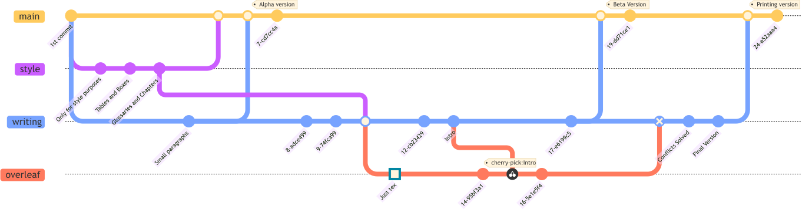

# Thesis Manuscript Repository 📄

This repository contains the source code and assets for my thesis manuscript.
It is written with **LaTeX**, compiled via **LuaLaTeX** and includes figures
generated using **Python (Matplotlib and Seaborn)**, **GNUPlot** and **Wolfram
Mathematica**. Some diagrams were created with **Mermaid**, **Diagrams**, and
**Graphviz**. Image editing was done in **GIMP** and **Inkscape**, some
animations and pictures were also done with **Blender** (mainly for slides but
not the manuscript).

Happy writting ✨

Contact me if you need help but take into account that this project is not my
priority, since well... i've already submited my thesis (so yep i'm a doctor)

---

## Getting Started

1. **Check dependencies** 🏗️
   Run `checkdeps.sh` to verify that all required tools are available:
   ```
   ./checkdeps.sh
   ```
   This checks for `bash`, `make`, `lualatex`, `bibtex`, `makeglossaries`,
   `python3` (with `matplotlib` and `numpy`), `rsvg-convert`, `GIMP`, and
   `Inkscape`. It provides OS-aware install hints (Homebrew on macOS, apt on
   Debian/Ubuntu, dnf on Fedora, pacman on Arch). On macOS it also detects
   `.app` bundles and creates symlinks if needed.
   If a Python interpreter with all required packages is found, the script
   updates the `PYTHON` path in the Makefile automatically.
   To auto-install missing Python packages:
   ```
   ./checkdeps.sh --install
   ```

2. **Quick Build** 🚀
   - `make all` — Full compilation: generates plots, converts images, and
     compiles the thesis.
   - `make tex` — Compiles the full thesis (with BibTeX and glossaries).
   - `make fast` — Compiles quickly without BibTeX or glossaries (useful for
     layout previews).
   - `make style` — Compiles a standalone PDF with example tables, box styles,
     etc.
   - `make test chapter=<name>` — Compiles only a specific chapter (e.g.,
     `chapter=methodology`). Add `bib=true` for bibliography.
   - `make config` — Runs `checkdeps.sh` from within the Makefile.
   - `make config-install` — Runs `checkdeps.sh --install`.
   - `make help` — Shows all available targets and flags.
   By default, auxiliary files (`.aux`, `.bbl`, `.toc`, etc.) are cleaned
   after a successful compilation. To keep them:
   ```
   make tex KEEP_LOGS=true
   ```
   or equivalently:
   ```
   make tex keep-logs
   ```
   The main `make.log` is always preserved.

---

## Repository Structure

- `chapters/`
  Individual `.tex` files for each chapter with their own subdivisions.
- `figures/` or `img/`
  Plots, images, diagrams, and figure source files.
- `preambulo/`
  Custom `.tex` files for preamble (libraries).
- `styles/`
  Custom `.sty` files and font configurations (includes basic Cyrillic support).
- `Makefile`
  Automates compilation workflows.
- `compile.sh`
  Spinner wrapper for LaTeX passes — shows progress with a live animation,
  and on failure displays the last 20 log lines with highlighted `.tex`
  paths and line numbers.
- `checkdeps.sh`
  Dependency checker and optional installer.
- `tesis.tex`
  Main entry point for building the thesis PDF.

> ⚠️  **Note on Windows**: This project is tested on GNU/Linux, macOS, and
> Overleaf. Windows is untested and probably unsupported.

---

## Git Workflow and PLMlatex (Overleaf) Strategy

While the recommended workflow is through the command line using vim, nano,
emacs (or any text editor of your choice), Overleaf support is provided but
with limitations. A Git-based branching strategy helps manage this:

- `writing` — Main local branch for manuscript development.
- `overleaf` — Mirror branch for Overleaf use.

### Suggested Process for Overleaf Sync

1. Checkout or create the `overleaf` branch locally.
2. Pull any changes made in Overleaf.
3. Delete existing files on Overleaf to reset the working state.
4. Merge from `writing` using:
   ```
   git merge writing --allow-unrelated-histories
   ```
 
The next diagram does not show the real git tree of my manuscript but
illustrates the main idea of how it should flow over the different branches.


> ⚠️  **Note**: Git on Overleaf is only available for premium users. The
> project is big so you probably also need more compilation time than the free
> tier on Overleaf provides.

